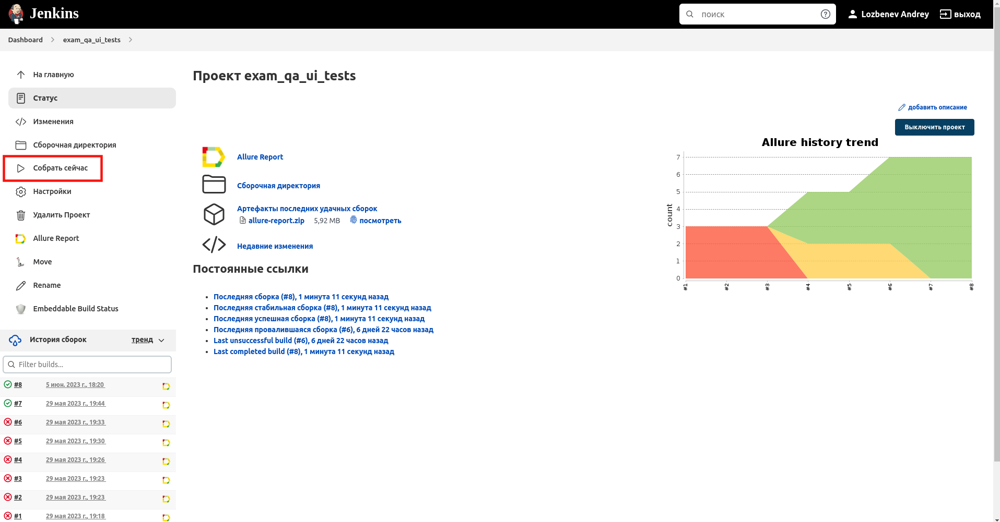
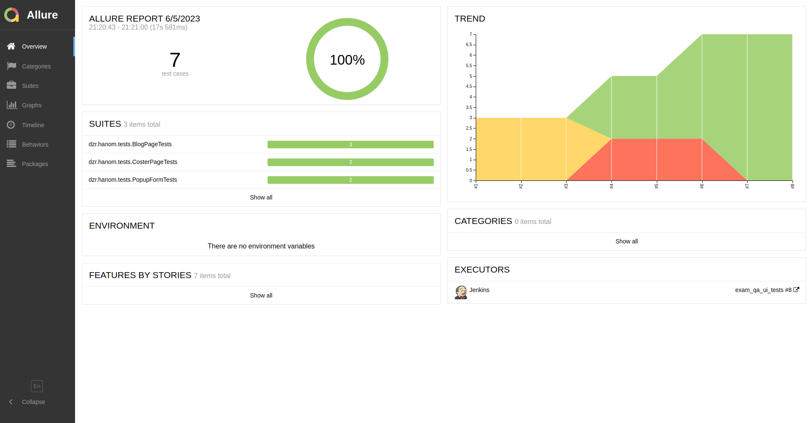
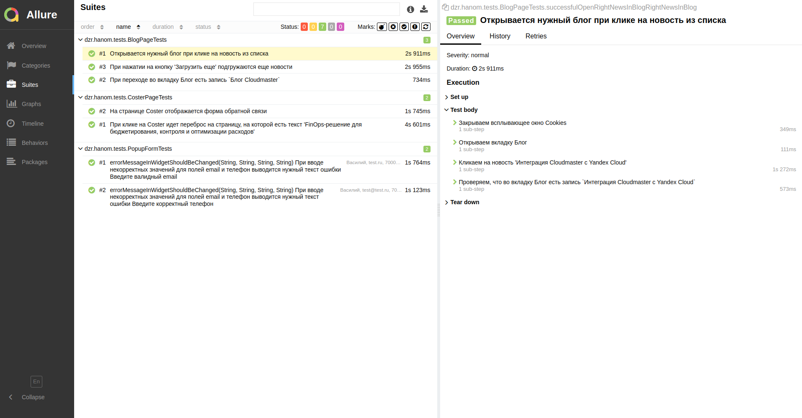
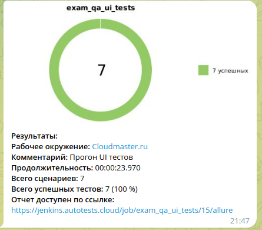
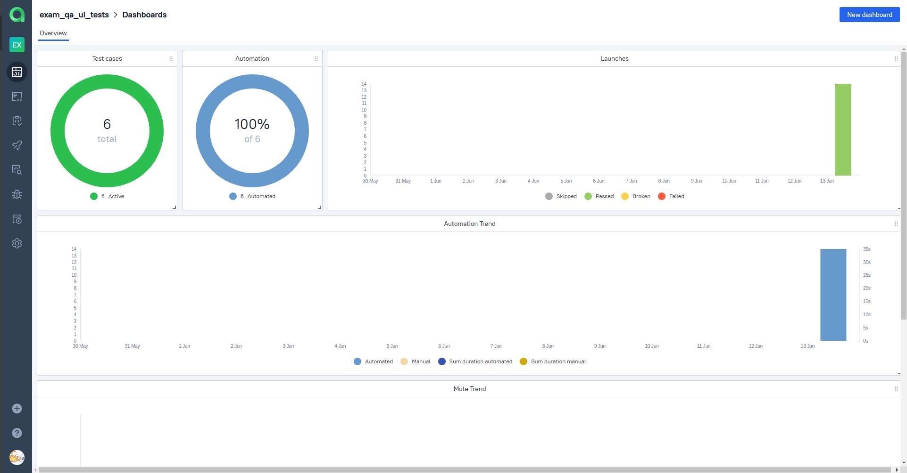
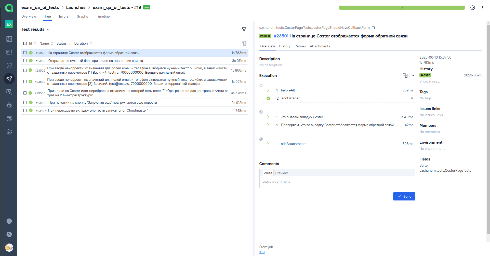
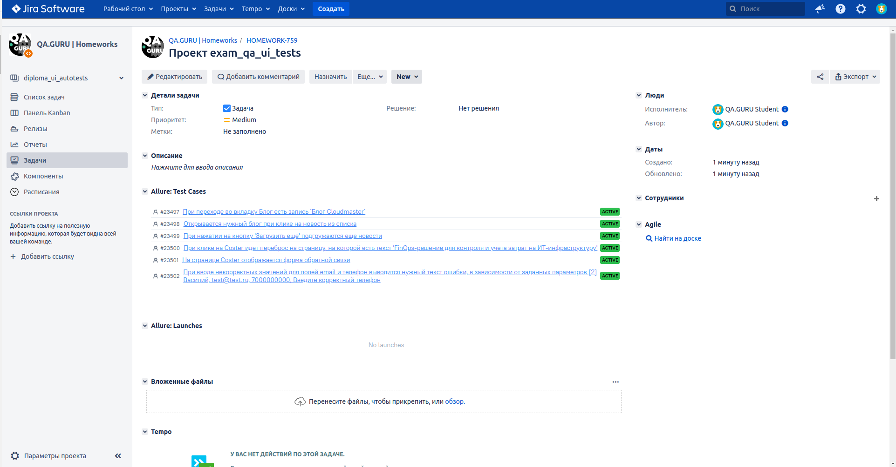

# Проект автоматизации UI тестирования для <a target="_blank" href="https://cloudmaster.ru/">Cloudmaster</a>

## :open_book: Содержание:
- [Технологии и инструменты](#gear-в-проекте-используются-следующие-технологии-и-инструменты)
- [Что проверяем](#heavy_check_mark-что-проверяем)
- [Запуск тестов из Jenkins](#-запуск-тестов-из-jenkins)
- [Запуск тестов из терминала](#computer-запуск-тестов-из-терминала)
- [Отчеты](#bar_chart-отчеты-о-прохождении-тестов-доступны-в-allure)
- - [Allure](#-allure)


## :gear: В проекте используются следующие технологии и инструменты:

<p align="center">


<a href="https://qameta.io/"></a>
</p>

## :heavy_check_mark: Что проверяем

> - Открывается нужный блог при клике на новость из списка 
> - При нажатии на кнопку 'Загрузить еще' подгружаются еще новости 
> - При переходе во вкладку Блог есть запись `Блог Cloudmaster` 
> - На странице Coster отображается форма обратной связи 
> - При клике на Coster идет переброс на страницу, на которой есть текст 'FinOps-решение для бюджетирования, контроля и оптимизации расходов'
> - При вводе некорректных значений для полей email и телефон выводится нужный текст ошибки Введите валидный email
##  Запуск тестов из [Jenkins](https://jenkins.autotests.cloud/job/Students/job/exam_qa_ui_tests/)

Для запуска тестов из Jenkins:
1. Необходимо нажать кнопку "Собрать".
   
2. Нажать кнопку "Собрать".

# Запуск тестов
Для запуска тестов на Selenoid использовать команду ниже:
```shell
gradle test -Denv=remote
```

Для запуска тестов локально использовать команду ниже:
```shell
gradle test -Denv=local
```

## :bar_chart: Отчеты о прохождении тестов доступны в Allure

###  [Allure](https://jenkins.autotests.cloud/job/exam_qa_ui_tests/8/allure/)

#### Главная страница



#### Тесты



## <a id="telegram"></a> Отчёт в Telegram

После завершения сборки сообщение с основными результатами прогона тестов отправляется через созданный бот в выбранный телеграм-канал
<p align="center">


## </a> Интеграция с <a target="_blank" href="https://allure.autotests.cloud/project/3415/dashboards">Allure TestOps</a>

### Dashboard с  результатами тестирования
<p align="center">

</p>

### Пример отчёта выполнения одного из автотестов
<p align="center">

</p>

## </a> Интеграция с <a target="_blank" href="https://jira.autotests.cloud/browse/HOMEWORK-759">Atlassian Jira</a>
<p align="center">

</p>


###  Видео примера запуска тестов в Selenoid

К каждому тесту в отчете прилагается видео прогона.
<p align="center">
  
</p>
